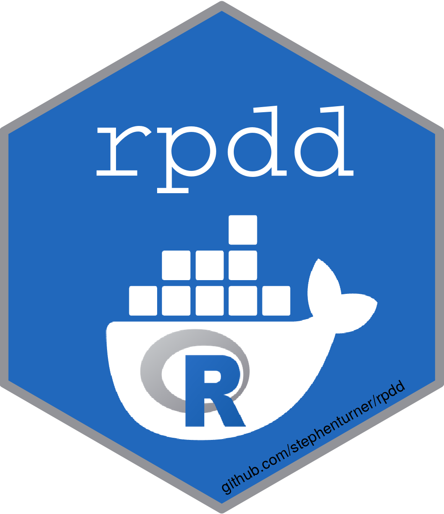

<!-- README.md is generated from README.Rmd. Please edit that file -->

```{r, include = FALSE}
knitr::opts_chunk$set(
  collapse = TRUE,
  comment = "#>",
  fig.path = "man/figures/README-",
  out.width = "100%"
)
```

# rpdd <a href='https://github.com/stephenturner/rpdd'></a>

<!-- badges: start -->
[](https://github.com/stephenturner/rpdd/actions/workflows/R-CMD-check.yaml)
<!-- badges: end -->

<!-- 
Journal of Brief Ideas

Docker containers with embedded R packages and domain-specific tools

R packages are collections of functions, documentations, tests, sample data, and dependency declarations, which come together to promote modularity, reproducibility, and adherence to good coding practices. Containerization using technologies such as Docker allow for building a specific computing environment with all required dependencies, configuration files, and system libraries needed to run any computing process reproducibly and at scale. Further, Docker allows computing environments to be _specified in code_, such that the instructions for building the infrastructure itself can be specified in code. Many data science and bioinformatics tasks involve running some domain-specific tools for initial analysis, followed by postprocessing using R. The `rpdd` package provides a demonstration on how to create a Docker image with an embedded R package and domain-specific tools. The `rpdd` package comes with a build script, which first builds the R package, then builds a Docker image containing that package, along with domain-specific tools and dependencies. When the container is instantiated, it runs a script that uses domain-specific tools to preprocess input data, and runs functions from the R package to postprocess the output from the first step. Code and further documentation is available at <https://github.com/stephenturner/rpdd>.

-->

The goal of rpdd is to demonstrate how to build an R package, build a Docker image that contains the built package, and how to run a pipeline inside the container using package functions. 

## R package

### Installation

You can install the rpdd R package from [GitHub](https://github.com/stephenturner/rpdd) with:

``` r
# install.packages("remotes")
remotes::install_github("stephenturner/rpdd")
```

### Example

The rpdd package has a single function: `missyelliot()`. This function reverse complements a DNA sequence (take it, flip it, and reverse it). Its input is a character vector and it returns a named vector.

```{r example}
library(rpdd)
missyelliot("GATTACA")
```

The `missyelliot()` function can also be used inside a pipeline. Here demonstrating using base R, but this could be used with tibble and dplyr as well.

```{r}
data.frame(original_sequence=c("GATTACA", "GATACAT", "ATTAC", "GAGA")) |>
  transform(revcomp=missyelliot(original_sequence))
```

## Docker container

The Docker container does more than the R package. The container itself runs a short pipeline. It first runs a shell script ([docker/src/rpdd.sh](docker/src/rpdd.sh)) which takes two arguments: a FASTA file and a BED file. The container will use [seqtk](https://github.com/lh3/seqtk) to pull out sequence in the FASTA file corresponding to the intervals in the BED file, and writes that to `<inputfastafilename>.regions.txt`. The container then runs an R script ([docker/src/rpdd.R](docker/src/rpdd.R)) to read in that data, and reverse complements those sequences, writing them out to `<inputfastafilename>.revcomp.txt`.

After going through the documentation below, study the following files in order to get a sense of what's going on:

1. [docker/Dockerfile](docker/Dockerfile)
1. [docker/src/rpdd.sh](docker/src/rpdd.sh)
1. [docker/src/rpdd.R](docker/src/rpdd.R)

### Build

Use the [build.sh](build.sh) script. This builds the R package, copies the build package into [docker/src](docker/src), then builds the docker image with appropriate tags.

```sh
./build.sh
```

### Usage

The container starts running at `/data/` inside the container, so you must first mount a directory on the host to the `/data/` directory in the container. Alternatively, you can navigate to where your data files live, and mount the current working directory to the same path on the host, and set that as the working directory. Examples are shown below.

Example testing data files are located in [inst/extdata](inst/extdata) in this repo. Here's the [inst/extdata/seq.fasta](inst/extdata/seq.fasta) file:

```{r, comment='', echo=FALSE}
cat(readLines("inst/extdata/seq.fasta"), sep="\n")
```

Here's the [inst/extdata/reg.bed](inst/extdata/reg.bed) file:

```{r, comment='', echo=FALSE}
cat(readLines("inst/extdata/reg.bed"), sep="\n")
```

The container will use seqtk to pull out contig 1 positions 7-14, and contig 2 positions 28-35, and it will reverse complement them, writing output alongside the input files.

```{sh, eval=FALSE}
docker run --rm -v /full/host/path/to/inst/extdata:/data rpdd seq.fasta reg.bed
```

What are these flags? 

- `--rm`: By default, when a Docker container is run without this flag, the Docker container is created, the container runs, and then exits, but is not deleted. In other words, Docker containers are NOT ephemeral by default. A local copy of the container is kept and takes up unnecessary storage space. It is a good idea to always use this flag so that the container is removed after running it, unless for some reason you need the container after the specified program has been run.
- `-v /full/host/path/to/inst/extdata:/data`: The -v flag mounts a volume between your local machine and the Docker container. This specific command mounts `/full/host/path/to/inst/extdata` the `/data` directory within the Docker container, which makes the files on your local machine accessible to the container, which starts in `/data` by default. 

Here's what you'll see:

```
Input fasta:   seq.fasta
Input regions: reg.bed
Writing sequence in select regions to seq.fasta.regions.txt ...
Writing reverse complemented region sequences to seq.fasta.revcomp.txt ...
```

Let's take a look at the output file [inst/extdata/seq.fasta.regions.txt](inst/extdata/seq.fasta.regions.txt):

```{r, comment='', echo=FALSE}
cat(readLines("inst/extdata/seq.fasta.regions.txt"), sep="\n")
```

These are the regions we extracted above. Let's take a look at the output file [inst/extdata/seq.fasta.revcomp.txt](inst/extdata/seq.fasta.revcomp.txt), which has the reverse complemented sequences we extracted ("Gattaca!", "Get A Cat!"):

```{r, comment='', echo=FALSE}
cat(readLines("inst/extdata/seq.fasta.revcomp.txt"), sep="\n")
```

Running Docker in this way on a Linux system will create files owned by root that you cannot remove. Further, you might want to run this on files in the directory you're in. Here's how to do that.

```{sh, eval=FALSE}
# Go somewhere where you have the data located. E.g.
# cd inst/extdata
docker run --rm -v $(pwd):$(pwd) -w $(pwd) -u $(id -u):$(id -g) rpdd seq.fasta reg.bed
```

What's the rest of this doing? 

- `$(pwd):$(pwd)`: This mounts your present working directory (e.g., `/home/yourname/wherever/`) to a directory _inside the container_ with the same name.
- `-w $(pwd)`: This sets the working directory _inside the container_ to the same directory. Now, the files that you have on disk on the host will be available in the container. This is what you might be accusomed to if you use Singularity.
- `-u $(id -u):$(id -g)`: By default, when Docker containers are run, they are run as the root user. This can be problematic because any files created from within the container will have root permissions/ownership and the local user will not be able to do much with them. The -u flag sets the container's user and group based on the user and group from the local machine, resulting in the correct file ownership.

Optional, you can create a function in your `~/.bashrc` that looks like this:

```
function docker_run  { docker run --rm -v $(pwd):$(pwd) -w $(pwd) -u $(id -u):$(id -g) "$@"; }
```

This allows you to use `docker_run <image> <args>` instead of `docker run --rm -v $(pwd):$(pwd) -w $(pwd) -u $(id -u):$(id -g) <image> <args>`.

# Further reading

The StaPH-B Docker User Guide is a great place to start. Read all the chapters (drop-down in the upper right). Some of the documentation on command line flags to `docker run` came from this guide. Go read: **https://staphb.org/docker-builds/**.

The Nust et al 2020 _PLoS Comp Bio_ article, "Ten simple rules for writing Dockerfiles for reproducible data science" is also a great resource: **https://doi.org/10.1371/journal.pcbi.1008316**.
